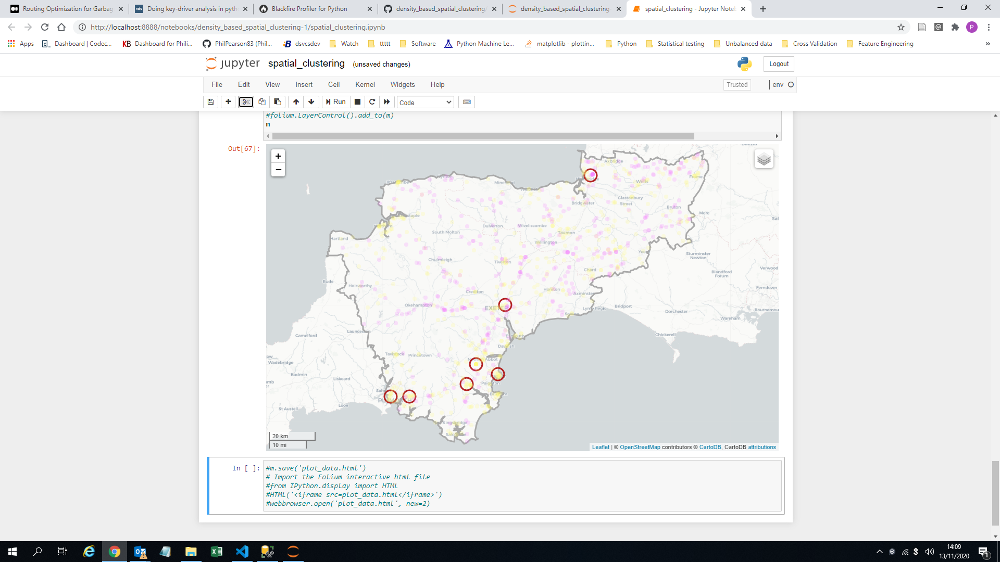

# Density Based Clustering of Applications with Noise (DBSCAN)

This repository contains example code and documentation for clustering using dbscan algorithm and displaying the output on a map generated using Folium.

[](https://mybinder.org/v2/gh/PhilPearson83/density_based_spatial_clustering/HEAD?filepath=spatial_clustering.ipynb)
<a href="https://github.com/PhilPearson83/density_based_spatial_clustering/blob/master/LICENSE"></a>
<a href="https://github.com/PhilPearson83/density_based_spatial_clustering"></a>



---

_Contents:_ **[Directory Layout](#Directory-Layout)** | **[Installation](#installation)** | **[🚀 Quick Start](#-quick-start)** | **[Reference](#reference)** | **[FAQ](#faq)**

---

### Directory Layout

```
.
├── data
│   ├── geospatial
│   │   ├── DSFRS_Service_Area.cpg
│   │   ├── DSFRS_Service_Area.dbf
│   │   ├── DSFRS_Service_Area.prj
│   │   ├── DSFRS_Service_Area.qpj
│   │   ├── DSFRS_Service_Area.shp
│   │   └── DSFRS_Service_Area.shx
│   └── dsfrs_stations.csv
├── example
│   ├── example.png
│   └── example_data.csv
├── .gitignore
├── Licence
├── README.md
├── ers_failures.sql
├── requirements.txt
└── spatial_clustering.ipynb
```

### Installation
First clone the repository and navigate to the project's root directory:
```bash
git clone https://github.com/PhilPearson83/density_based_spatial_clustering.git
cd density_based_spatial_clustering
```

This project is written in [`Python`](https://www.python.org/) and depends on the packages in the requirements.txt.

You can install these packages by running the following command in the project's root directory:

```bash
# pip install requirements.txt 
```
### 🚀 Quick Start

### Reference

#### All functions have output customization
* `max_value_str_len` max length of each variable string, -1 to disable, default=1000
* `max_exc_str_len` max length of exception, should variable print fail, -1 to disable, default=10000
* 
* 
* 

### FAQ
