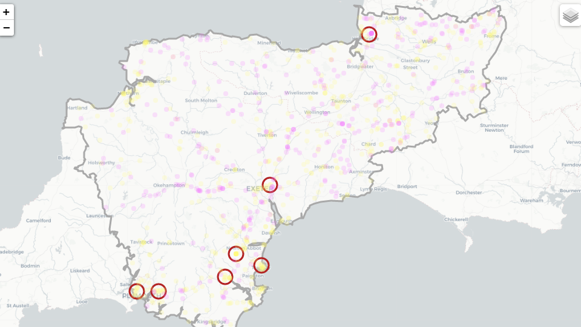

# Density Based Clustering of Applications with Noise (DBSCAN)
[](https://mybinder.org/v2/gh/PhilPearson83/density_based_spatial_clustering/HEAD?filepath=spatial_clustering.ipynb)

This repository contains example code and documentation for clustering data using dbscan algorithm and displaying the resultant output on a map generated using Folium.



# Directory Layout

```
.
├── data
│   ├── geospatial
│   │   ├── DSFRS_Service_Area.cpg
│   │   ├── DSFRS_Service_Area.dbf
│   │   ├── DSFRS_Service_Area.prj
│   │   ├── DSFRS_Service_Area.qpj
│   │   ├── DSFRS_Service_Area.shp
│   │   └── DSFRS_Service_Area.shx
│   └── dsfrs_stations.csv
├── example
│   ├── example.png
│   └── example_data.csv
├── .gitignore
├── Licence
├── README.md
├── ers_failures.sql
├── requirements.txt
├── spatial_clustering.ipynb
└── spatial_clustering.py
```
## Getting Started.

### Installation
First clone the repository and navigate to the project's root directory:
```bash
git clone https://github.com/PhilPearson83/density_based_spatial_clustering.git
cd density_based_spatial_clustering
```

This project is written in [`Python`](https://www.python.org/) and depends on the packages in the requirements.txt.

You can install these packages by running the following command in the project's root directory:

```bash
# pip install requirements.txt 
```
